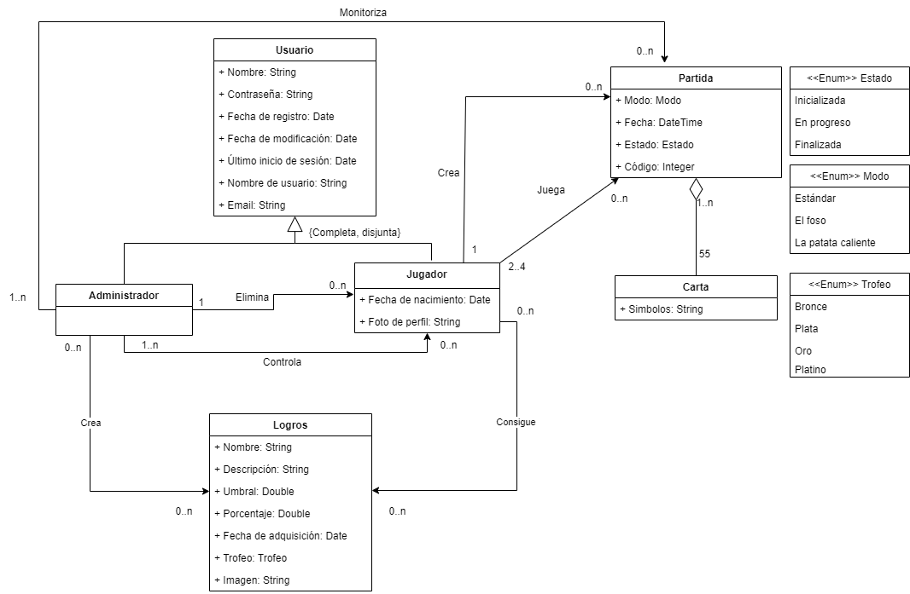

# Enlace video

[Gameplay dobble](https://youtu.be/KzSEJYlkOZE)

## Running petclinic locally
Petclinic is a [Spring Boot](https://spring.io/guides/gs/spring-boot) application built using [Maven](https://spring.io/guides/gs/maven/). You can build a jar file and run it from the command line:


```
git clone https://github.com/gii-is-DP1/spring-petclinic.git
cd spring-petclinic
./mvnw package
java -jar target/*.jar
```

You can then access petclinic here: http://localhost:8080/


Or you can run it from Maven directly using the Spring Boot Maven plugin. If you do this it will pick up changes that you make in the project immediately (changes to Java source files require a compile as well - most people use an IDE for this):

```
./mvnw spring-boot:run
```

### Steps:

1) On the command line
```
git clone https://github.com/gii-is-DP1/dp1-2022-2023-l8-4.git
```
2) Inside Eclipse or STS
```
File -> Import -> Maven -> Existing Maven project
```

Then either build on the command line `./mvnw generate-resources` or using the Eclipse launcher (right click on project and `Run As -> Maven install`) to generate the css. Run the application main method by right clicking on it and choosing `Run As -> Java Application`.

3) Inside IntelliJ IDEA

In the main menu, choose `File -> Open` and select the Petclinic [pom.xml](pom.xml). Click on the `Open` button.

CSS files are generated from the Maven build. You can either build them on the command line `./mvnw generate-resources`
or right click on the `spring-petclinic` project then `Maven -> Generates sources and Update Folders`.

A run configuration named `PetClinicApplication` should have been created for you if you're using a recent Ultimate
version. Otherwise, run the application by right clicking on the `PetClinicApplication` main class and choosing
`Run 'PetClinicApplication'`.

4) Navigate to Petclinic

Visit [http://localhost:8080](http://localhost:8080) in your browser.


## Looking for something in particular?

|Spring Boot Configuration | Class or Java property files  |
|--------------------------|---|
|The Main Class | [PetClinicApplication](https://github.com/gii-is-DP1/spring-petclinic/blob/master/src/main/java/org/springframework/samples/petclinic/PetClinicApplication.java) |
|Properties Files | [application.properties](https://github.com/gii-is-DP1/spring-petclinic/blob/master/src/main/resources) |
|Caching | [CacheConfiguration](https://github.com/gii-is-DP1/spring-petclinic/blob/master/src/main/java/org/springframework/samples/petclinic/system/CacheConfiguration.java) |

# License

The Spring PetClinic sample application is released under version 2.0 of the [Apache License](https://www.apache.org/licenses/LICENSE-2.0).

[spring-petclinic]: https://github.com/spring-projects/spring-petclinic
[spring-framework-petclinic]: https://github.com/spring-petclinic/spring-framework-petclinic
[spring-petclinic-angularjs]: https://github.com/spring-petclinic/spring-petclinic-angularjs 
[javaconfig branch]: https://github.com/spring-petclinic/spring-framework-petclinic/tree/javaconfig
[spring-petclinic-angular]: https://github.com/spring-petclinic/spring-petclinic-angular
[spring-petclinic-microservices]: https://github.com/spring-petclinic/spring-petclinic-microservices
[spring-petclinic-reactjs]: https://github.com/spring-petclinic/spring-petclinic-reactjs
[spring-petclinic-graphql]: https://github.com/spring-petclinic/spring-petclinic-graphql
[spring-petclinic-kotlin]: https://github.com/spring-petclinic/spring-petclinic-kotlin
[spring-petclinic-rest]: https://github.com/spring-petclinic/spring-petclinic-rest

# Historias de usuario

## H1 - Crear partida
Como jugador quiero poder crear una partida y elegir un modo de juego (el foso, patata caliente, la torre infernal), mostrando un código de juego que otros jugadores podrán usar para acceder a la partida, para poder jugar en una partida propia.

### Escenarios Positivos:
* **H1+E1 - Creación exitosa:**

Dado que estamos logueados en el sistema como jugador, cuando elijamos un modo de juego de los 3 posibles, entonces seremos enviados a una página con el código de la partida, el modo de juego y una sala donde aparecerán el resto de jugadores (H2).

### Escenarios Negativos:
* **H1-E1 - Número de jugadores inválido:**

Dado que estamos logueados en el sistema como jugador, cuando marquemos un número de jugadores que no esté entre 2 y 4, entonces se lanzará un mensaje indicando que no se puede hacer una partida con con más de 4 o menos de 2 personas.

## H2 - Acceso a salas de partida
Como jugador quiero poder acceder a una sala para poder jugar en base a las reglas del modo de juego.

### Escenarios Positivos:
* **H2+E1 - Acceso a la partida:**

Dado que estamos logueados en el sistema como jugador y ha introducido un código de partida correcto, cuando pulsamos el botón de unirse, entonces somos redirigidos a la sala deseada.

### Escenarios Negativos:
* **H2-E2 - Partida no encontrada:**

Dado que estamos logueados en el sistema como jugador y ha introducido un código de partida incorrecto o inexistente, cuando pulsamos el botón de unirse, entonces somos notificados de que la sala que buscamos no existe.

* **H2-E3 - Partida comenzada:**

Dado que estamos logueados en el sistema como jugador y hemos introducido un código de partida ya empezada, cuando pulsamos el botón de unirse, entonces somos notificados de que la partida ya ha comenzado y no podremos jugar.

## H3 - Visualización partidas

Como jugador quiero poder ver un listado de mis partidas jugadas, para así poder saber qué he hecho en la aplicación.

### Escenarios Positivos:
* **H3+E1 - Información cargada y mostrada exitosamente:**

Dado que estamos logueados en el sistema como jugador, cuando accedemos al enlace de las partidas jugadas, entonces se muestra en la parte inferior un listado con las partidas creadas y otra con las partidas jugadas ordenadas de partidas más recientes a más antiguas.

## H4 - Visualización de partidas actuales

Como administrador quiero poder ver un listado de las partidas en curso así los jugadores de cada partida, para así poder tener información diversa sobre las partidas actuales.

### Escenarios Positivos:
* **H4+E1 - Información mostrada correctamente:**

Dado que estamos logueados en el sistema como administrador, cuando accedemos al enlace de las partidas actuales, entonces se muestra un listado de las partidas actuales con el nombre de cada jugador.

## H5 - Listado de partidas jugadas y participantes

Como administrador quiero poder ver un listado de las partidas que se han jugado con los jugadores que hayan participado en ellas, para tener información sobre el uso de la aplicación.

### Escenarios positivos:
* **H5+E1 - Visualización de la lista:**

Dado que estamos autenticados en el sistema como administrador y se ha llevado a cabo al menos una partida, cuando accedemos al enlace de la lista de partidas, tras pulsar el botón de mostrar lista, entonces la lista de partidas y participantes se muestra.

### Escenarios negativos:
* **H5-E1 - Acceso prohibido a la lista:**

Dado que no estamos autenticados en el sistema como administrador, cuando accedemos al enlace de la lista de partidas, tras pulsar el botón de mostrar lista, entonces la lista de partidas y participantes no se muestra.

* **H5-E2 - Lista vacía:**

Dado que estamos autenticados en el sistema como administrador y no se ha llevado a cabo ninguna partida, cuando accedemos al enlace de la lista de partidas, tras pulsar el botón de mostrar lista, entonces se muestra un mensaje que indica que no hay información para mostrar.

## H6 - Login, logout y sing-up de jugador

Como jugador quiero poder crear una cuenta, iniciar sesión en la aplicación y cerrar dicha sesión, para tener una forma de identificarme con mi cuenta personal en el juego y desconectarme cuando quisiera. 

### Escenarios positivos:

* **H6+E1 - Login exitoso:**

Dado que hemos introducido las credenciales correctas y el usuario existe en el sistema, cuando pulsamos el botón de login, entonces se inicia sesión como el jugador pertinente. 

* **H6+E2 - Log Out exitoso:**

Dado que hemos iniciado sesión previamente en el sistema, cuando pulsamos el botón de logout, entonces se finaliza la sesión del jugador.

* **H6+E3 - Sign-up exitoso:**

Dado que hemos introducido la información adecuada para el nuevo usuario y no hemos dejado ningún campo en blanco, cuando pulsamos el botón de sign-up, entonces se crea el jugador, se almacena en el sistema y se inicia sesión con dicho usuario.

### Escenarios negativos:

* **H6-E1 - Login fallido por credenciales incorrectas:**

Dado que no hemos introducido las credenciales correctas, cuando pulsamos el botón de login, entonces se muestra un mensaje de error de inicio de sesión por credenciales incorrectas. 

* **H6-E2 - Login fallido por inexistencia del usuario:**

Dado que el usuario no existe en el sistema, cuando pulsamos el botón de login, entonces se muestra un mensaje de error de inicio de sesión por no existir el usuario en el sistema. 

* **H6-E3 - Sign-up fallido por campo obligatorio vacío:**

Dado que no hemos rellenado todos los campos obligatorios del formulario de registro (nombre, nickname, correo electrónico, contraseña y fecha de nacimiento), cuando pulsamos el botón de sign-up, entonces se mostrará un mensaje de error al crear el usuario por no rellenar campos obligatorios.

* **H6-E4 - Sign-up fallido por nickname repetido:**

Dado que hemos introducido un nickname ya existente en el sistema, cuando pulsamos el botón de sign-up, entonces se mostrará un mensaje de error al crear el usuario por nickname existente.

## H7 - Edición del perfil personal

Como jugador quiero que el sistema me permita editar mi perfil con un nombre de usuario y/o foto o avatar disponible, para poder ser distinguido durante la partida.

### Escenarios Positivos:

* **H7+E1 – Edición de la foto de perfil:**

Dado que estamos autenticados en el sistema como jugador y tenemos un documento apropiado, cuando pulsamos el perfil, tras pulsar el botón de añadir foto y elegir una foto disponible, entonces se muestra el perfil actualizado y se mostrará actualizado en las partidas.

* **H7+E2 – Edición del nombre:**

Dado que estamos autenticados en el sistema como jugador, cuando pulsamos el perfil, tras pulsar el botón de cambiar nombre y escribir un nombre adecuado, entonces se muestra el perfil actualizado y se mostrará actualizado en las partidas.

## H8 - Listado de usuarios registrados

Como administrador quiero que el sistema me permita acceder a la información importante asociada a los jugadores, para poder gestionar los usuarios dentro del sistema.

### Escenarios Positivos:

* **H8+E1 – Obtener la información del jugador:**

Dado que estamos autenticados en el sistema como administrador, cuando accedemos al enlace de la lista de jugadores, entonces se muestra la lista de jugadores y podemos realizar una consulta y obtener el nombre, nombre de usuario, contraseña, correo electrónico, fecha de registro, último inicio de sesión, fecha de modificación y fecha de nacimiento para poder, por ejemplo, enviar un correo electrónico a ese jugador sobre algún cambio en el sistema.

## H9 - CRUD de usuarios

Como administrador quiero que el sistema permita realizar un CRUD (Create, Read, Update, Delete) completo de los usuarios con comprobación de seguridad y borrado en cascada de partidas, estadísticas, etc., para poder llevar un control sobre los usuarios y sus partidas.

### Escenarios Positivos:

* **H9+E1 - Creación de un usuario nuevo:**

Dado que estamos autenticados en el sistema como administrador, cuando pulsamos para crear un nuevo usuario que no está en el sistema, entonces el nuevo usuario se añade al sistema junto a todos sus datos.

* **H9+E2 - Lectura de un usuario que está en el sistema:**

Dado que estamos autenticados en el sistema como administrador, cuando pulsamos para consultar información de un usuario que está en el sistema, entonces el sistema muestra todos los datos de dicho usuario al administrador.

* **H9+E3 - Edición de un usuario que está en el sistema:**

Dado que estamos autenticados en el sistema como administrador, cuando pulsamos para editar información de un usuario que está en el sistema, entonces el administrador podrá editar los datos de dicho usuario.

* **H9+E4 - Borrado de un usuario que está en el sistema:**

Dado que estamos autenticados en el sistema como administrador, cuando pulsamos para eliminar la información de un usuario que está en el sistema, tras aceptar la confirmación, entonces los datos de dicho usuario serán borrados del sistema.

### Escenarios Negativos:

* **H9-E1 - Creación de un usuario que ya se encuentra en el sistema:**

Dado que estamos autenticados en el sistema como administrador, cuando pulsamos para crear un usuario que ya está registrado en el sistema, entonces el sistema debe mandar un mensaje de error al administrador.

* **H9-E2 - Lectura de un usuario que no está en el sistema:**

Dado que estamos autenticados en el sistema como administrador, cuando pulsamos para consultar información de un usuario que no está en el sistema, entonces el sistema debe mandar un mensaje de error al administrador.

* **H9-E3 - Creación de un usuario sin información:**

Dado que estamos autenticados en el sistema como administrador y no hemos rellenado correctamente todos los campos del formulario de creación de usuario, cuando pulsamos para crear un usuario, entonces el sistema debe mandar un mensaje de error al administrador.

## H10 - Auditoría de los datos de los perfiles de los usuarios

Como administrador quiero que el sistema permita realizar una auditoría completa de los datos de los perfiles de los usuarios para poder recoger y administrar información sobre los usuarios de cara a futuras decisiones.

### Escenarios Positivos:

* **H10+E1 - Auditoría correcta:**

Dado que estamos autenticados en el sistema como administrador y existen usuarios registrados en el sistema, cuando solicitamos una auditoría de los usuarios, entonces el sistema muestra al administrador los datos solicitados.

### Escenarios Negativos:

* **H10-E1 - Auditoría sin usuarios:**

Dado que estamos autenticados en el sistema como administrador y no existen usuarios registrados en el sistema, cuando solicitamos una auditoría de los usuarios, entonces el sistema debe mandar un mensaje de error al administrador.

## H11 - Conteo de puntos durante partida

Como jugador quiero que el sistema durante la partida, en el modo foso y torre infernal, me informe respectivamente acerca de los puntos ganados por mi compañeros y los puntos posibles de conseguir en las siguientes rondas, para tener un sencillo seguimiento de la partida.

### Escenarios Positivos:

* **H11+E1 - Ver puntos:**

Dado que estamos autenticados en el sistema como jugador, cuando estamos jugando una partida en el modo de juego torre infernal o el foso, entonces podemos ver cuántos puntos hemos ganado y cuántos tienen nuestros rivales. Además de nuestros puntos y los puntos que quedan por obtener, mentalmente podríamos calcular cuántos se necesitan para ganar.

## H12 - Obtener el ganador al final

Como jugador quiero que el sistema, al acabar la partida, en cualquier modo de juego, me informe acerca de quién ganó la partida para tener una forma de ver el resultado de forma satisfactoria.

### Escenarios Positivos:

* **H12+E1 - Ver ganador:**

Dado que estamos autenticados en el sistema como jugador, cuando termina una partida, entonces podemos ver quién es el ganador.

## H13- Crud de Logros
Como administrador quiero crear, eliminar, visualizar y editar  logros que se irán consiguiendo durante el juego para dar desafíos a nuestros usuarios.

### Escenarios Positivos:

* **H13+E1 - Creación de un logro nuevo:**

Dado que estamos autenticados en el sistema como administrador, cuando pulsamos para crear un nuevo logro que no está en el sistema, entonces el nuevo logro se añade al sistema junto a todos sus datos.

* **H13+E2 - Lectura de un logro que está en el sistema:**

Dado que estamos autenticados en el sistema como administrador, cuando pulsamos para consultar información de un logro que está en el sistema, entonces el sistema muestra todos los atributos de dicho logro al administrador.

* **H13+E3 - Edición de un logro que está en el sistema:**

Dado que estamos autenticados en el sistema como administrador, cuando pulsamos para editar información de un logro que está en el sistema, entonces el administrador podrá editar los datos de dicho logro.

* **H13+E4 - Borrado de un logro que está en el sistema:**

Dado que estamos autenticados en el sistema como administrador, cuando pulsamos para eliminar la información de un logro que está en el sistema, tras aceptar la confirmación, entonces los datos de dicho logro serán borrados del sistema.

## H14 - Visualizar Logros

Como jugador  quiero poder ver qué logros he conseguido y cuáles quedan por completar para  poder ver si son acequibles de conseguir.

### Escenarios Positivos:

* **H14+E1 - Visualización de logros:**

Dado que estamos autenticados en el sistema como jugador, cuando pulsamos para consultar información de un logro que está en el sistema, entonces el sistema muestra todos los atributos de dicho logro al jugador.

* **H14+E2 - Visualización de logros conseguidos:**

Dado que estamos autenticados en el sistema como jugador, cuando pulsamos para consultar información de nuestros logros conseguidos, entonces el sistema muestra todos los atributos de los logros del jugador conseguidos.

# Modelo de datos




# Reglas de Negocio

## R1 – Conteo cartas correcto (que el total de cartas que han pasado por cada jugador no sobrepase 55)

Al terminar una partida, tanto en el modo de juego el foso y la torre infernal, la suma total de puntos de todos los jugadores debe de ser igual a 55 (número total de cartas).

## R2 – Una carta no puede salir más de una vez en la misma partida

El juegos posee un total de 55 cartas con más de 50 símbolos , 8 símbolos en cada carta cada una distinta de las demás, teniendo un símbolo en común en todas.

## R3 – Siempre habrá una única coincidencia entre dos cartas aleatorias

Para que el juego funcione correctamente, cada carta debe de tener coincidencia entre dos cartas aleatorias, en cualquier modo de juego, teniendo un símbolo en común (por ejemplo un cactus), obteniendo como finalidad que un jugador encuentre el símbolo de en común con las otras.

## R4 – Una partida solo tendrá entre 2 y 4 jugadores

Para que un jugador pueda iniciar una partida, deben de unirse como mínimo 2 personas y un máximo de 4. De modo inverso, un jugador no podrá unirse a una sala que está ya completa.
